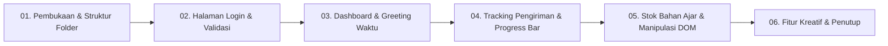

# Panduan & Naskah Demo Tugas 1 STSI4209 (Pemrograman Berbasis Web - UT)
**SITTA - Sistem Informasi Tiras dan Transaksi Bahan Ajar Universitas Terbuka**
*Ditujukan untuk: Mas Faiq (Tutor Online Program Studi Sistem Informasi)*

---

## 📌 Ringkasan Proyek & Target Penilaian (100 Poin)

| Kriteria Rubrik | Poin | Implementasi pada Proyek SITTA |
| :--- | :---: | :--- |
| **1.1. HTML Semantik & Valid** | 15 | Menggunakan elemen semantik modern: `<header>`, `<nav>`, `<main>`, `<section>`, `<article>`, `<table>`, `<form>`, `<footer>`. Tidak memakai `div soup`. |
| **1.2. Desain CSS** | 15 | Menerapkan 3 jenis CSS:<br>• **External**: `css/style.css`<br>• **Internal**: `<style>` pada `<head>` di `dashboard.html`<br>• **Inline**: `style="..."` pada elemen tertentu. |
| **1.3. JavaScript DOM** | 25 | • Event handling (click, input, submit, keyup)<br>• Manipulasi DOM dinamis (tambah baris tabel dengan `createElement`, remove baris tabel)<br>• Modal box popup (Lupa Password & Daftar Akun)<br>• Alert box interaktif. |
| **1.4. Validasi Form & Alert** | 15 | • Validasi email & password kosong / format email salah.<br>• Pesan alert sesuai soal: *"email/password yang anda masukkan salah"*. Highlight border merah (`.error`) dan pesan error kontekstual. |
| **1.5. Modularitas File** | 5 | Struktur file bersih sesuai panduan soal:<br>`index.html`, `dashboard.html`, `tracking.html`, `stok.html`, folder `css/`, dan folder `js/` (`data.js`, `login.js`, `dashboard.js`, `tracking.js`, `stok.js`). |
| **1.6. Kreativitas Tambahan** | 10 | • Fitur **Dark Mode Toggle** dengan persistensi `localStorage`.<br>• **Filter Pencarian Real-time** pada data stok bahan ajar.<br>• Status pengiriman dengan visual progress bar bertingkat (33%, 66%, 100%) dan badge warna.<br>• Riwayat perjalanan pengiriman (timeline tracking). |
| **1.7. Alur & Argumentasi Video** | 15 | Sistematika demo terstruktur, runut, dan mendidik dengan durasi ideal 10–14 menit (maksimal 15 menit). |

---

## 🎬 Skenario & Naskah Alur Demo (Estimasi 12 Menit)



### Segmen 1: Pembukaan & Struktur Proyek (Menit 00:00 – 02:00)
- **Tindakan**:
  - Tampilkan struktur folder proyek di code editor (VS Code / Antigravity).
- **Poin Penjelasan Tutor**:
  - *"Halo rekan-rekan mahasiswa UT, pada video ini saya akan mendemonstrasikan implementasi Tugas Praktik 1 Pemrograman Berbasis Web untuk sistem SITTA (Sistem Informasi Tiras dan Transaksi Bahan Ajar)."*
  - Tunjukkan kepatuhan struktur folder:
    - Root: `index.html` (halaman login), `dashboard.html`, `tracking.html`, `stok.html`.
    - `css/style.css` (external styling).
    - `js/data.js` (dummy data konstanta `dataBahanAjar`, `dataTracking`, `users`) dan file JS modular per halaman.
  - Tunjukkan bahwa data dummy di `js/data.js` memenuhi ketentuan soal tanpa back-end/database.

---

### Segmen 2: Halaman Login & Validasi Form (Menit 02:00 – 04:30)
- **Tindakan**:
  1. Buka `index.html` di browser.
  2. Klik **Masuk** dalam kondisi field kosong -> Tunjukkan validasi email tidak boleh kosong.
  3. Masukkan email salah `salah@ut.ac.id` dan password `123` -> Klik **Masuk**.
  4. Muncul alert box: *"Email/password yang anda masukkan salah"*.
  5. Klik tautan **Lupa password?** -> Muncul Modal Box (tutup dengan tombol silang `×`).
  6. Klik tombol **Daftar** -> Muncul Modal Box pendaftaran akun (tutup kembali).
  7. Masukkan akun valid dari `data.js`: `faiq@ut.ac.id` / `faiq123` (atau `admin@ut.ac.id` / `admin123`).
  8. Klik **Masuk** -> Berhasil redirect ke `dashboard.html`.
- **Poin Penjelasan Tutor**:
  - Jelaskan bagaimana form divalidasi via event `loginForm.addEventListener('submit', ...)` dan `e.preventDefault()`.
  - Jelaskan implementasi Modal Box murni CSS & JS DOM (toggle class `.active` tanpa library eksternal).
  - Jelaskan penyimpanan sesi sederhana via `localStorage.setItem('sitta_user', ...)`.

---

### Segmen 3: Dashboard & Greeting Dinamis (Menit 04:30 – 06:30)
- **Tindakan**:
  1. Tunjukkan banner greeting: *"Selamat Pagi/Siang/Sore/Malam, [Nama User]"*.
  2. Tunjukkan badge `UT Daerah` di header (sebagai contoh penerapan **Internal CSS** di tag `<style>`).
  3. Tunjukkan 4 Menu Utama dalam bentuk grid cards:
     - Informasi Bahan Ajar
     - Tracking Pengiriman
     - Laporan (dengan dropdown submenu: *Monitoring Progress DO* dan *Rekap Bahan Ajar*)
     - Histori Transaksi Bahan Ajar
  4. Klik tombol **🌙 (Dark Mode)** di kanan atas -> Halaman berubah menjadi tema gelap secara instan.
- **Poin Penjelasan Tutor**:
  - Jelaskan logika penentuan waktu lokal dengan objek `new Date().getHours()` di `dashboard.js`.
  - Tunjukkan submenu interaktif pada card Laporan menggunakan `.sub-menu.active`.

---

### Segmen 4: Tracking Pengiriman Bahan Ajar (Menit 06:30 – 09:00)
- **Tindakan**:
  1. Klik menu card **Tracking Pengiriman** (atau buka `tracking.html`).
  2. Gunakan fitur **Quick Chips** (klik tombol chip `DO-001 (Sampai)` atau `DO-002 (Dikirim)`) untuk pengujian instan.
  3. Tunjukkan elemen tampilan **Waybill Card Modern**:
     - Label No. DO, Status badge menyala, Tanggal Kirim.
     - Nama Mahasiswa & Identitas NIK tebal.
     - **Visual Route Tracker**: Asal pengiriman (`TANJUNGPANDAN`) ── 🚚 ──> Tujuan (`PEMATANGSIANTAR`).
  4. Tunjukkan **Stepper Status 3 Tahap**:
     - Lingkaran node (1: Diproses, 2: Dikirim, 3: Sampai) dengan active indicator dan teks status dinamis.
  5. Tunjukkan 4 Kartu Detail Ekspedisi: Mitra Ekspedisi, Tgl Kirim, Jenis Paket, dan Total Biaya Rupiah.
  6. Tunjukkan **Timeline Riwayat Perjalanan Paket** dengan pulsating glowing radar dot pada titik transit terkini.
  7. Klik chip / input nomor DO tidak terdaftar (`DO-999`) -> Tunjukkan feedback alert error yang jelas.
  8. Klik tautan `← Kembali ke Dashboard`.
- **Poin Penjelasan Tutor**:
  - Jelaskan pencarian array object dengan JavaScript DOM murni.
  - Jelaskan implementasi UI modern Waybill Card & Stepper tanpa library pihak ketiga.

---

### Segmen 5: Informasi Stok & Dual-View DOM (Menit 09:00 – 11:30)
- **Tindakan**:
  1. Klik menu **Informasi Bahan Ajar** (buka `stok.html`).
  2. Tunjukkan **3 Kartu Metrik Statistik Real-Time**:
     - Total Judul Bahan Ajar (10 Modul)
     - Total Fisik Stok Tersedia (2.323 Eks)
     - Stok Menipis / Perlu Restok (< 100)
  3. Tunjukkan **Dual-View Switcher**:
     - Klik tombol **🗂️ Katalog**: Tampilan beralih ke grid kartu buku artistik bergaya modul BMP UT (sesuai contoh soal PDF hal. 4).
     - Klik tombol **📋 Tabel**: Tampilan kembali ke tabel dengan status ketersediaan (Aman, Terbatas, Kritis).
  4. Coba pencarian real-time (ketik `Ekonomi` atau `Komunikasi`) dan filter dropdown jenis modul (BMP / Modul / Praktikum).
  5. Klik tombol **➕ Tambah Baris Stok Baru**:
     - Isi form tambah (Kode Lokasi, Kode Modul, Nama Materi, Edisi, Stok).
     - Klik **Simpan Data** -> Baris baru langsung muncul di Tabel, Katalog, dan angka Metrik otomatis terupdate tanpa refresh!
  6. Tunjukkan tombol **Hapus** -> Menghapus data dan otomatis memperbarui DOM di kedua mode tampilan.
- **Poin Penjelasan Tutor**:
  - Tunjukkan bagaimana konsep manipulasi DOM dapat menyajikan data yang sama dalam dua representasi berbeda (Tabel vs Katalog Buku).
  - Soroti sinkronisasi state data array dengan metrik counter di DOM.

---

### Segmen 6: Fitur Kreativitas & Penutup (Menit 11:30 – 13:00)
- **Tindakan**:
  1. Demonstrasikan konsistensi Dark Mode di semua halaman (Login, Dashboard, Tracking, Stok).
  2. Klik tombol **Logout** -> Menghapus session `localStorage` dan kembali ke halaman login.
- **Poin Penjelasan Tutor**:
  - Rangkum kembali penerapan HTML Semantik, 3 jenis CSS (external, internal, inline), validasi form, manipulasi DOM tabel, serta modularitas script.
  - Berikan motivasi dan tips kepada mahasiswa untuk mengerjakan tugas dengan teliti dan mengeksplorasi kreativitas UI/UX masing-masing.

---

## 🔑 Data Uji Coba Cepat (Cheatsheet untuk Rekaman)

### Akun Login (`js/data.js`):
- `faiq@ut.ac.id` / `faiq123` (Nama: Faiq Najib)
- `admin@ut.ac.id` / `admin123` (Nama: Admin UT)
- `mahasiswa@ut.ac.id` / `mahasiswa123` (Nama: Mahasiswa UT)

### Nomor Delivery Order (`DO`):
- `DO-001` (ROIKA HEPRIDA SITIO - Status: Sampai, JNE)
- `DO-002` (BUDI SANTOSO - Status: Dikirim, SiCepat)
- `DO-003` (SITI RAHAYU - Status: Diproses, J&T)
- `DO-999` (Contoh pengujian kasus DO tidak ditemukan)

### Tambah Stok Baru:
- Kode Lokasi: `OTMP06`
- Kode Barang: `MSIM4201`
- Nama Barang: `Sistem Operasi UT`
- Jenis: `BMP`, Edisi: `1`, Stok: `100`

---

## 🌐 Perintah Menjalankan Server Lokal
Untuk menjalankan server demo kapan saja di port 8000:
```bash
cd /home/orin/code/archive/tugas-1
python3 -m http.server 8000
```
Buka di browser: `http://localhost:8000/index.html`
